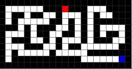

# __KHEC C++班　サンプル作品__


## __作品説明__
このプログラムは迷路のデータを読み込み、そのゴールまでの最短経路を求めます。

<br>

## __プログラム説明__
### __方針__
迷路を解くアルゴリズムにDFSというものがあります。
分かり易く、強力なので今回はこれを使っていこうと思います。

<br>

### __DFSとは__
Deep First Search 日本語だと深さ優先探索と言ったりします。
名前の通り、行けるところまで探索していくアルゴリズムです。
<br>


イメージ↓


では実装していきましょう。

<br>

## __実装__

### __参照渡し__
```c++
void f(int x){
    x=2;
}
```
という関数fがあったとして、
```c++
int x=0;
f(x);
```
としたら、```x```の値は何でしょうか?
関数の中で```x```に代入しても、元々の変数xは0のままです。
変えたければ、
```c++
void f(int& x){
    x=2;
}
```
というように、```&```を```int```の前に付ければ```x```の値は2に変わります。
これを参照渡しと言います。
この後に1度だけ使います。

<br>

### __配列__
迷路は2次元配列で管理するので、x,y座標をもとにして管理していきましょう。
c++には配列の代わりになるvectorというものが用意されています。
int型の配列を作りたければ、
```c++ 
vector<int> name;
```
と書けば作れます。
大きさが8の配列を作りたければ、
```c++
vector<int> name(8);
```
とします。
アクセスはArduinoと同じく、
```c++
name[0]=8;
```
とすればよいです。

vectorにはいくつかの便利な関数が付いています。
例えば、配列の長さを知りたければ、
```c++
name.size();
```
とすると、配列の長さが分かります。

また、配列の末尾に要素を追加したければ、
```c++
name.push_back(2);
```
とします。
こうすると、
```c++
vector<int> name={0,1};
name.push_back(2);
//name={0,1,2}になる。
```
といった風になります
もちろん、name.size()は3になります。

<br>

### __二次元配列__
二次元配列は
```c++
vector<vector<int>> name;
```
とします。

毎回
```c++
vector<vector<int>>
```
と書くのは面倒なので、新しくmapという名前を付けましょう。
```c++
using map=vector<vector<int>>;
```
と代入すれば新しい名前を付けれます。

<br>

### __座標の実装__
迷路の地点はx,y座標で管理します。
よって、(1,3)のように二つの数をまとめられる型が必要になります。
c++にはpairという型があります。
```c++
pair<int,int> p;
```
の様にすると、int型2つをまとめられます。
今後は座標をpair型で表すので、
```c++
using coordinate=pair<int,int>;
```
として、coordinate(座標)という名前を付けておきます。

c++には```make_pair()```という関数が用意されてます。
```make_pair(1,2);```とすれば```(1,2)```というpair型の変数が作られます。

<br>

### __迷路の実装__
単純に、二次元配列で迷路を表現してみましょう。
今回は、0で道を、1で障害物を表します。
```c++
map maze_ = {{1, 1, 1, 1, 1, 1, 1, 1, 1, 1, 1, 1, 1, 1, 1, 1, 1, 1, 1, 1, 1},
             {1, 0, 0, 0, 0, 0, 0, 1, 1, 1, 0, 1, 1, 1, 0, 0, 0, 1, 1, 1, 1},
             {1, 0, 1, 1, 0, 1, 1, 0, 0, 1, 0, 0, 0, 1, 0, 1, 0, 0, 1, 1, 1},
             {1, 0, 1, 0, 0, 0, 0, 0, 1, 1, 0, 1, 0, 1, 0, 1, 1, 1, 1, 1, 1},
             {1, 1, 1, 0, 1, 0, 1, 1, 1, 0, 0, 1, 0, 1, 0, 1, 0, 0, 0, 0, 1},
             {1, 0, 0, 0, 1, 0, 1, 1, 0, 0, 1, 1, 0, 1, 0, 1, 0, 1, 1, 0, 1},
             {1, 0, 1, 1, 1, 0, 0, 1, 0, 1, 0, 0, 0, 1, 0, 1, 1, 1, 0, 0, 1},
             {1, 0, 0, 0, 1, 1, 1, 0, 0, 1, 0, 1, 1, 0, 0, 0, 0, 0, 0, 1, 1},
             {1, 0, 1, 0, 0, 0, 0, 0, 1, 0, 0, 0, 0, 0, 1, 1, 1, 1, 1, 1, 1},
             {1, 0, 1, 1, 1, 1, 1, 1, 1, 1, 1, 1, 1, 0, 0, 0, 0, 0, 0, 0, 1},
             {1, 1, 1, 1, 1, 1, 1, 1, 1, 1, 1, 1, 1, 1, 1, 1, 1, 1, 1, 1, 1}};
```
これは以下の迷路と一致します。



<br>

### __DFSの実装__
唐突ですが、関数の中でその関数を呼び出したらどうなるでしょうか？
```c++
void f(){
    f();
} 
```
としてみます。
動作はしますが、関数fのなかでfが呼ばれて、また関数fのなかでfが呼ばれて、、となり、無限に続いてしまいます。
では、条件を満たしたときに関数をもう呼ばなくしてみましょう。
```c++
void f(int depth){
    if(depth==0){
        return;
    }
    f(depth-1);
}
```
この関数を呼んでみます。
```c++
f(3);
```
すると、
f(3)の中でf(3-1)つまりf(2)が。
f(2)の中でf(1)が。
f(1)の中でf(0)が呼ばれ、
f(0)は条件を満たすので、もう何も呼ばなくなり終わります。
これを再帰と言います。

このアイデアをDFSに活かすことが出来ます。
地点Aから動ける場所が無ければもう呼べなくさせる、という関数を実装してみましょう。
```c++
void DFS(coordinate now){
    vector<coorinate> visitable;
    for(int i=0;i<visitable.size();i++){
        DFS(visitable[i]);
    }
}
```
この関数は、visitable、つまり行ける座標の数だけ再帰します。
このままではvisitableは空のままなので、行ける座標を調べましょう。
迷路は上下左右の、障害物のあるところ以外に移動できます。
それをコードで表すと、
```c++
void DFS(map maze,coordinate now){
    vector<coordinate> visitable;
    int x=now.first;
    int y=now.second;
    if(maze[y][x-1]==0){
        visitable.push_back(make_pair(x-1,y));
    }
    for(int i=0;i<visitable.size();i++){
        DFS(maze,visitable[i]);
    }
}
```
こうすることで、左側の座標に行けるかを調べられます。
行けるならば、```visitable.push_back```しています。
また、行けるかどうかを調べるには迷路のデータが必要なので、迷路も引数に含めるようにしました。

上下左右も調べます。
```c++
void DFS(map maze,coordinate now){
    vector<coordinate> visitable;
    int x=now.first;
    int y=now.second;
    if(maze[y][x-1]==0){
        visitable.push_back(make_pair(x-1,y));
    }
    if(maze[y][x+1]==0){
        visitable.push_back(make_pair(x+1,y));
    }
    if(maze[y-1][x]==0){
        visitable.push_back(make_pair(x,y-1));
    }
    if(maze[y+1][x]==0){
        visitable.push_back(make_pair(x,y+1));
    }
    for(int i=0;i<visitable.size();i++){
        DFS(maze,visitable[i]);
    }
}
```
しかし、このままでは元々居た場所にも行けてしまいます。
（無限ループが起きてしまう）
普通の迷路で同じ場所を通る意味は無いので、一度通った場所にはもう通らないようにしましょう。
今回は、```visited```という2次元配列を用意して、通った場所を記録します。
```c++
void DFS(map maze,coordinate now,map visited){
    vector<coordinate> visitable;
    int x=now.first;
    int y=now.second;

    visited[y][x]=1;

    if(maze[y][x-1]==0){
        visitable.push_back(make_pair(x-1,y));
    }
    if(maze[y][x+1]==0){
        visitable.push_back(make_pair(x+1,y));
    }
    if(maze[y-1][x]==0){
        visitable.push_back(make_pair(x,y-1));
    }
    if(maze[y+1][x]==0){
        visitable.push_back(make_pair(x,y+1));
    }
    for(int i=0;i<visitable.size();i++){
        int tx=visitable[i].first;
        int ty=visitable[i].second;
        if(visited[ty][tx]==1){

        }else{
            DFS(maze,visitable[i],visited);
        }
    }
}
```
もし、行ける座標でも、もう訪れた事があれば行かないようにしました。
いよいよ、ゴールに着いたかどうかを判定してみましょう。

今回はゴールも引数で受け取ります。
```c++
void DFS(map maze,coordinate now,coordinate goal,map visited){
    if(now==goal){

    }
    vector<coordinate> visitable;
    int x=now.first;
    int y=now.second;

    visited[y][x]=1;

    if(maze[y][x-1]==0){
        visitable.push_back(make_pair(x-1,y));
    }
    if(maze[y][x+1]==0){
        visitable.push_back(make_pair(x+1,y));
    }
    if(maze[y-1][x]==0){
        visitable.push_back(make_pair(x,y-1));
    }
    if(maze[y+1][x]==0){
        visitable.push_back(make_pair(x,y+1));
    }
    for(int i=0;i<visitable.size();i++){
        int tx=visitable[i].first;
        int ty=visitable[i].second;
        if(visited[ty][tx]==1){

        }else{
            DFS(maze,visitable[i],goal,visited);
        }
    }
}
```
もしも今いる座標がゴールならば、という条件式を追加しました。

では、ゴールまでの手数をカウントしましょう。
```depth```という引数を追加して、手数を数えます。
また、答えは参照渡しで受け取るようにします。

```c++
void DFS(map maze,coordinate now,coordinate goal,map visited,int depth,int& answer){
    if(now==goal){
        answer=depth;
    }
    vector<coordinate> visitable;
    int x=now.first;
    int y=now.second;

    visited[y][x]=1;

    if(maze[y][x-1]==0){
        visitable.push_back(make_pair(x-1,y));
    }
    if(maze[y][x+1]==0){
        visitable.push_back(make_pair(x+1,y));
    }
    if(maze[y-1][x]==0){
        visitable.push_back(make_pair(x,y-1));
    }
    if(maze[y+1][x]==0){
        visitable.push_back(make_pair(x,y+1));
    }
    for(int i=0;i<visitable.size();i++){
        int tx=visitable[i].first;
        int ty=visitable[i].second;
        if(visited[ty][tx]==1){

        }else{
            DFS(maze,visitable[i],goal,visited,depth+1,answer);
        }
    }
}
```

これで、ゴールまでの手数を得ることが出来ます。
では、確かめてみましょう。

## __実際に動かしてみよう__
### __main()__
Arduinoでは、setup()とloop()があったと思いますが、c++にはmain()という関数の中に処理を書きます。<br>
また、main()はloop()とは違い、一度しか実行されません。

<br>

### __include__
Arduinoと同じく、ファイルを読み込みます。<br>
c++は標準ライブラリという、公式が出しているライブラリがあります。<br>
(ArduinoでのSerialライブラリのような感じ）

<br>

### __using namespace std__
これは名前を省略できるようにする命令ですが、あまり考えなくてもいいです。

<br>

### __出力の仕方__
Arduinoでは```Serial.println("HELLO");```をすることで出力出来ましたが、
c++では```cout << "HELLO" << endl;```とすることで```HELLO```と出力できます。<br>
変数でも同じです。

<br>

### __STEP1 main関数を作ってみよう__
まずは、```main.cpp```という名前のファイルを作ってください。
(mainじゃなくてもいいですが、.cppという拡張子はしっかり付けてください)

main関数を書いてみましょう！！<br>
main関数はint型なので注意してください。<br>

using namespace std; はあんまり重要ではないので無視して大丈夫です。
```c++
using namespace std;
int main(){

}
```

<br>

### __STEP2 includeしてみよう__
includeしてみましょう！！
今回は、
iostream, vector, utility という標準ライブラリを読み込みます。

```c++
using namespace std;
#include <iostream>
#include <vector>
#include <utility>

int main(){

}
```

<br>

### __STEP3 mapとcoordinateを定義しよう__
省略のため、mapとcoordinateを定義しましょう！！
```c++
using namespace std;
#include <iostream>
#include <vector>
#include <utility>

using map=vector<vector<int>>;
using coordinate=pair<int,int>;

int main(){

}
```

<br>

### __STEP4 迷路を定義しよう__
0と1で表現された迷路を定義しましょう！！
```c++
using namespace std;
#include <iostream>
#include <vector>
#include <utility>

using map=vector<vector<int>>;
using coordinate=pair<int,int>;

map maze_ = {{1, 1, 1, 1, 1, 1, 1, 1, 1, 1, 1, 1, 1, 1, 1, 1, 1, 1, 1, 1, 1},
             {1, 0, 0, 0, 0, 0, 0, 1, 1, 1, 0, 1, 1, 1, 0, 0, 0, 1, 1, 1, 1},
             {1, 0, 1, 1, 0, 1, 1, 0, 0, 1, 0, 0, 0, 1, 0, 1, 0, 0, 1, 1, 1},
             {1, 0, 1, 0, 0, 0, 0, 0, 1, 1, 0, 1, 0, 1, 0, 1, 1, 1, 1, 1, 1},
             {1, 1, 1, 0, 1, 0, 1, 1, 1, 0, 0, 1, 0, 1, 0, 1, 0, 0, 0, 0, 1},
             {1, 0, 0, 0, 1, 0, 1, 1, 0, 0, 1, 1, 0, 1, 0, 1, 0, 1, 1, 0, 1},
             {1, 0, 1, 1, 1, 0, 0, 1, 0, 1, 0, 0, 0, 1, 0, 1, 1, 1, 0, 0, 1},
             {1, 0, 0, 0, 1, 1, 1, 0, 0, 1, 0, 1, 1, 0, 0, 0, 0, 0, 0, 1, 1},
             {1, 0, 1, 0, 0, 0, 0, 0, 1, 0, 0, 0, 0, 0, 1, 1, 1, 1, 1, 1, 1},
             {1, 0, 1, 1, 1, 1, 1, 1, 1, 1, 1, 1, 1, 0, 0, 0, 0, 0, 0, 0, 1},
             {1, 1, 1, 1, 1, 1, 1, 1, 1, 1, 1, 1, 1, 1, 1, 1, 1, 1, 1, 1, 1}};

int main(){

}
```

<br>

### __STEP5 DFS関数を書こう__
上で作ったDFS関数を書きましょう！！
```c++
using namespace std;
#include <iostream>
#include <vector>
#include <utility>

using map=vector<vector<int>>;
using coordinate=pair<int,int>;

map maze_ = {{1, 1, 1, 1, 1, 1, 1, 1, 1, 1, 1, 1, 1, 1, 1, 1, 1, 1, 1, 1, 1},
             {1, 0, 0, 0, 0, 0, 0, 1, 1, 1, 0, 1, 1, 1, 0, 0, 0, 1, 1, 1, 1},
             {1, 0, 1, 1, 0, 1, 1, 0, 0, 1, 0, 0, 0, 1, 0, 1, 0, 0, 1, 1, 1},
             {1, 0, 1, 0, 0, 0, 0, 0, 1, 1, 0, 1, 0, 1, 0, 1, 1, 1, 1, 1, 1},
             {1, 1, 1, 0, 1, 0, 1, 1, 1, 0, 0, 1, 0, 1, 0, 1, 0, 0, 0, 0, 1},
             {1, 0, 0, 0, 1, 0, 1, 1, 0, 0, 1, 1, 0, 1, 0, 1, 0, 1, 1, 0, 1},
             {1, 0, 1, 1, 1, 0, 0, 1, 0, 1, 0, 0, 0, 1, 0, 1, 1, 1, 0, 0, 1},
             {1, 0, 0, 0, 1, 1, 1, 0, 0, 1, 0, 1, 1, 0, 0, 0, 0, 0, 0, 1, 1},
             {1, 0, 1, 0, 0, 0, 0, 0, 1, 0, 0, 0, 0, 0, 1, 1, 1, 1, 1, 1, 1},
             {1, 0, 1, 1, 1, 1, 1, 1, 1, 1, 1, 1, 1, 0, 0, 0, 0, 0, 0, 0, 1},
             {1, 1, 1, 1, 1, 1, 1, 1, 1, 1, 1, 1, 1, 1, 1, 1, 1, 1, 1, 1, 1}};

void DFS(map maze,coordinate now,coordinate goal,map visited,int depth,int& answer){
    if(now==goal){
        answer=depth;
    }
    vector<coordinate> visitable;
    int x=now.first;
    int y=now.second;

    visited[y][x]=1;

    if(maze[y][x-1]==0){
        visitable.push_back(make_pair(x-1,y));
    }
    if(maze[y][x+1]==0){
        visitable.push_back(make_pair(x+1,y));
    }
    if(maze[y-1][x]==0){
        visitable.push_back(make_pair(x,y-1));
    }
    if(maze[y+1][x]==0){
        visitable.push_back(make_pair(x,y+1));
    }
    for(int i=0;i<visitable.size();i++){
        int tx=visitable[i].first;
        int ty=visitable[i].second;
        if(visited[ty][tx]==1){

        }else{
            DFS(maze,visitable[i],goal,visited,depth+1,answer);
        }
    }
}

int main(){

}
```

<br>

### __STEP6 DFS関数を動かそう__
main関数の中でDFS関数を動かして、迷路の答えを求めよう！！
今回は、迷路のスタート地点を(10,1), ゴール地点を(19,9)に設定します。
実際に出力された答えが本当に正しかったか、実際に迷路を解いて確認してみましょう！！


```c++
using namespace std;
#include <iostream>
#include <vector>
#include <utility>

using map=vector<vector<int>>;
using coordinate=pair<int,int>;

map maze = { {1, 1, 1, 1, 1, 1, 1, 1, 1, 1, 1, 1, 1, 1, 1, 1, 1, 1, 1, 1, 1},
             {1, 0, 0, 0, 0, 0, 0, 1, 1, 1, 0, 1, 1, 1, 0, 0, 0, 1, 1, 1, 1},
             {1, 0, 1, 1, 0, 1, 1, 0, 0, 1, 0, 0, 0, 1, 0, 1, 0, 0, 1, 1, 1},
             {1, 0, 1, 0, 0, 0, 0, 0, 1, 1, 0, 1, 0, 1, 0, 1, 1, 1, 1, 1, 1},
             {1, 1, 1, 0, 1, 0, 1, 1, 1, 0, 0, 1, 0, 1, 0, 1, 0, 0, 0, 0, 1},
             {1, 0, 0, 0, 1, 0, 1, 1, 0, 0, 1, 1, 0, 1, 0, 1, 0, 1, 1, 0, 1},
             {1, 0, 1, 1, 1, 0, 0, 1, 0, 1, 0, 0, 0, 1, 0, 1, 1, 1, 0, 0, 1},
             {1, 0, 0, 0, 1, 1, 1, 0, 0, 1, 0, 1, 1, 0, 0, 0, 0, 0, 0, 1, 1},
             {1, 0, 1, 0, 0, 0, 0, 0, 1, 0, 0, 0, 0, 0, 1, 1, 1, 1, 1, 1, 1},
             {1, 0, 1, 1, 1, 1, 1, 1, 1, 1, 1, 1, 1, 0, 0, 0, 0, 0, 0, 0, 1},
             {1, 1, 1, 1, 1, 1, 1, 1, 1, 1, 1, 1, 1, 1, 1, 1, 1, 1, 1, 1, 1}};

void DFS(map maze,coordinate now,coordinate goal,map visited,int depth,int& answer){
    if(now==goal){
        answer=depth;
    }
    vector<coordinate> visitable;
    int x=now.first;
    int y=now.second;

    visited[y][x]=1;

    if(maze[y][x-1]==0){
        visitable.push_back(make_pair(x-1,y));
    }
    if(maze[y][x+1]==0){
        visitable.push_back(make_pair(x+1,y));
    }
    if(maze[y-1][x]==0){
        visitable.push_back(make_pair(x,y-1));
    }
    if(maze[y+1][x]==0){
        visitable.push_back(make_pair(x,y+1));
    }
    for(int i=0;i<visitable.size();i++){
        int tx=visitable[i].first;
        int ty=visitable[i].second;
        if(visited[ty][tx]==1){

        }else{
            DFS(maze,visitable[i],goal,visited,depth+1,answer);
        }
    }
}

int main(){
    map visited=maze; //visitedを定義する
    int answer; //答えを受け取る変数を定義する
    coordinate start(10,1);
    coordinate goal(19,9);
    DFS(maze,start,goal,visited,0,answer);
    cout << answer << endl; //答えを出力する
}
```

## __最期に__
今回の作品を楽しんで頂けたでしょうか？
今回はDFSという、シンプルながら強力なアルゴリズムを使い、迷路を解くプログラムを作りました。
もちろん、迷路の解き方、解くアルゴリズムは他にもありますので、興味を持った方は是非調べてみてください。
この作品を通して、アルゴリズムの面白さや、プログラミングの奥深さを感じて頂ければ幸いです。
<br>
<br>
電子工学研究会 c++班